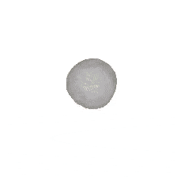
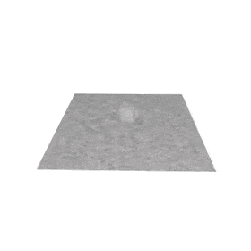
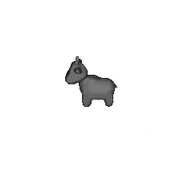
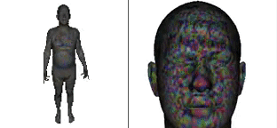

## CLIP-Mesh

Official implementation of [**CLIP-Mesh: Generating textured meshes from text using pretrained image-text models**](https://www.nasir.lol/clipmesh)<br/>

[Nasir Mohammad Khalid](https://www.nasir.lol/),
[Tianhao Xie](https://www.linkedin.com/in/tianhao-xie-440b20186/),
[Eugene Belilovsky](http://eugenium.github.io/),
[Tiberiu Popa](https://users.encs.concordia.ca/~stpopa/index.html)<br/>
_[SIGGRAPH ASIA 2022]() | [arXiv](https://arxiv.org/abs/2203.13333) | [Project page](https://www.nasir.lol/clipmesh)_


## Quickstart

Notebooks are unavilable working on restoring them:

|||
|:-----------------------------------------------------------------------------------------------------------:|:--------------------------------------------------:|
| Text to Mesh| Multi Mesh Generation|

|||
|:-----------------------------------------------------------------------------------------------------------:|:--------------------------------------------------:|
| Stylizing a Mesh| Apply CLIP-Mesh to Human Models|

## Setup

Clone this repository recursively to get all submodules - use submodule update to get downstream submodules

```
git clone --recurse-submodules https://github.com/NasirKhalid24/CLIP-Mesh.git
cd CLIP-Mesh
git submodule update --init --recursive
```

Setup Conda environment and install packages

```
conda create -n clip-mesh python=3.7
conda activate clip-mesh
conda install pytorch==1.11.0 torchvision==0.12.0 cudatoolkit=10.2 -c pytorch

pip install -r requirements.txt
```

Install loop subdivison code and DALLE-2 (not that DALLE-2 is from an earlier commit so existing install may not work)

```
<!-- Install Loop Subdivision -->
cd loop_limitation
pip install .
cd ..

<!-- Install DALLE2 - Diffusion Prior -->
cd DALLE2-pytorch
pip install .
cd ..

<!-- Get DALLE2 Prior Weights -->
mkdir weights
wget https://huggingface.co/spaces/NasirKhalid24/Dalle2-Diffusion-Prior/resolve/main/larger-model.pth -O ./weights/model.pth
```

## Usage

This repo comes with some configs that are passed to ```main.py``` using the ```--config``` flag

Any of the config paramaters can be overriden by passing them to as arguments to the ```main.py``` file so you can have a base .yml file with all your parameters and just update the text prompt to generate something new

An example would be using the given config file for single mesh generation ```single.yml```

```
# Use all parameters in file
python main.py --config configs/single.yml      

# Use all parameters in file but change text prompt
python main.py --config configs/single.yml  --text_prompt "a hamburger"    

# Use all parameters in file but change text prompt, batch, texture resolution
python main.py \
--config configs/single.yml \
--text_prompt "a hamburger" \
--batch_size 5 \
--texture_resolution 1024
```

## Tips, Tricks, FAQs etc

I recommend checking out the [following document](./assets/FAQ.md) as it could answer any doubts that come up (will be updated regularly) - if you still have questions reach out [@Nymarius_](https://twitter.com/Nymarius_) or open an issue
